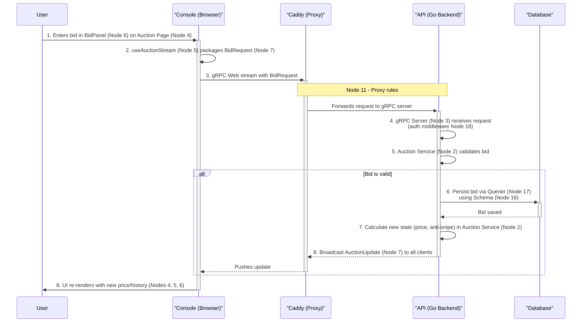

# System Data Flow (Bid Placement)

This diagram visualizes the "System Data Flow" described in the `README.md`. It traces a user's bid through the full stack, highlighting the interaction between different nodes of the system.

